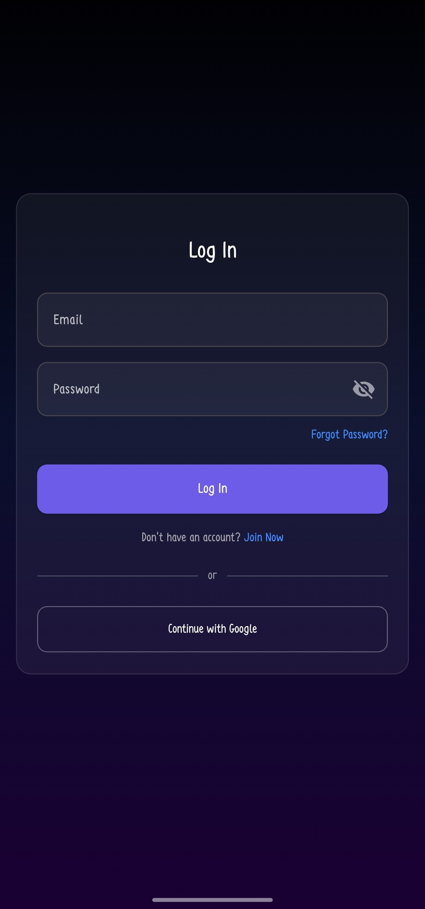
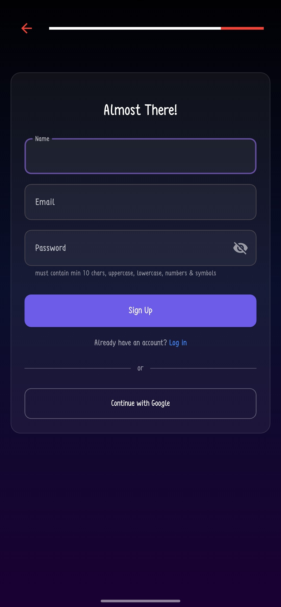
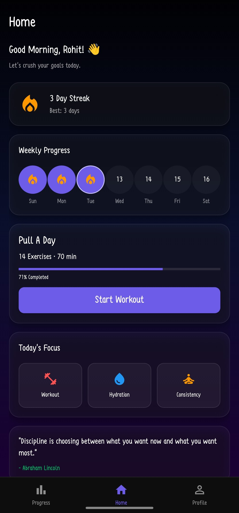
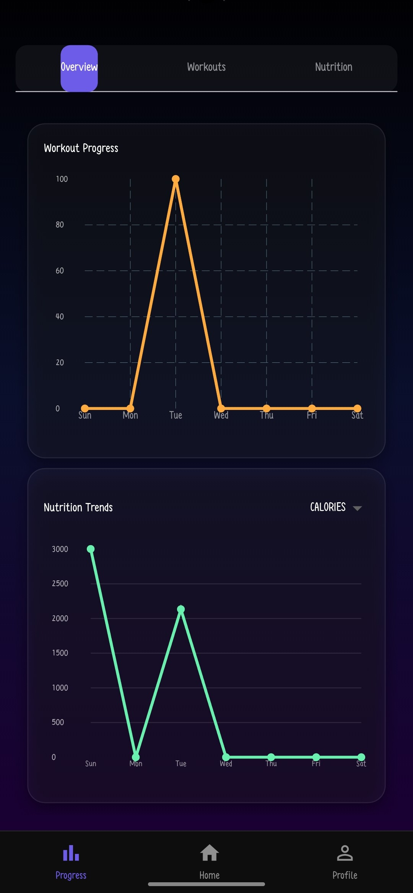

# FitNova
FitNova is a modern, mobile fitness tracking app built with Flutter which helps users keep track of their workouts, progress over time, and training consistency throughout their fitness journey.

## Table of Contents
* [About the Project](#about-the-project)
* [Getting Started](#getting-started)
* [Usage](#usage)
* [Roadmap](#roadmap)
* [Contributing](#contributing)
* [License](#license)
* [Contact](#contact)

## About the project
Smart Fitness Tracker App (Using Flutter + Firebase) The primary goal of this project is to implement a simple and light-weight application that allows users track their daily fitness activities, workout progress tracking and motivation based on consistency.

Application provides functionalities ranging from secure user authentication to workout management, attendance/streak tracking and progress monitoring. This project was created as a university Android application, as a part of requirements for an Android development exams where the mobile app idea should realize some main concepts like: implementing Firebase, mobile apps designing with responsive UI and modern app architecture using Flutter.

### Built With

* [Flutter](https://flutter.dev/)
* [Dart](https://dart.dev/)
* [Firebase](https://firebase.google.com/)
* [Firebase Authentication](https://firebase.google.com/products/auth)
* [Cloud Firestore](https://firebase.google.com/products/firestore)
* [Android Studio](https://developer.android.com/studio)

## Getting Started
Steps to set up project locally

### Prerequisites
Make sure the following software is installed:
```bash
Flutter SDK
Android Studio
Git
Firebase Account
```
## Installation

1. Clone the repository
```bash
git clone https://github.com/rohit-singh13/FitNova.git
```

2. Open the project folder
```bash
cd FitNova
```

3. Install all required dependencies
```bash
flutter pub get
```

4. Configure Firebase
- Create a Firebase project
- Add Android application in Firebase Console
- Download the `google-services.json` file
- Paste it inside:

```bash
android/app/
```

5. Run the application
```bash
flutter run
```

---

## Usage

FitNova helps users manage and monitor their fitness activities through an easy-to-use mobile interface.

Users can:

- Create and log into accounts securely
- Track workout activities
- Monitor fitness progress
- Maintain daily workout streaks
- Store user data securely using Firebase
- View progress and attendance records

---

## Screenshots

### Login Screen


### Signup Screen


### Home Screen


### Progress Screen


### Splash Screen


---

## Roadmap

### Completed Features

- User Authentication
- Firebase Integration
- Workout Tracking
- Attendance/Streak System
- Progress Monitoring
- Responsive UI Design

### Future Enhancements

- AI Workout Recommendations
- Diet Planner
- Push Notifications
- Dark Mode Support
- Water Intake Tracker
- Step Counter Integration

---

## Contributing

Contributions are welcome and appreciated.

To contribute:

1. Fork the repository

2. Create your feature branch

```bash
git checkout -b feature/AmazingFeature
```

3. Commit your changes

```bash
git commit -m "Add AmazingFeature"
```

4. Push to the branch

```bash
git push origin feature/AmazingFeature
```

5. Open a Pull Request

---

License
This project is developed for educational and academic purposes.

Contact
Rohit Singh - singhrohit82013@gmail.com

Project Link: https://github.com/rohit-singh13/FitNova
